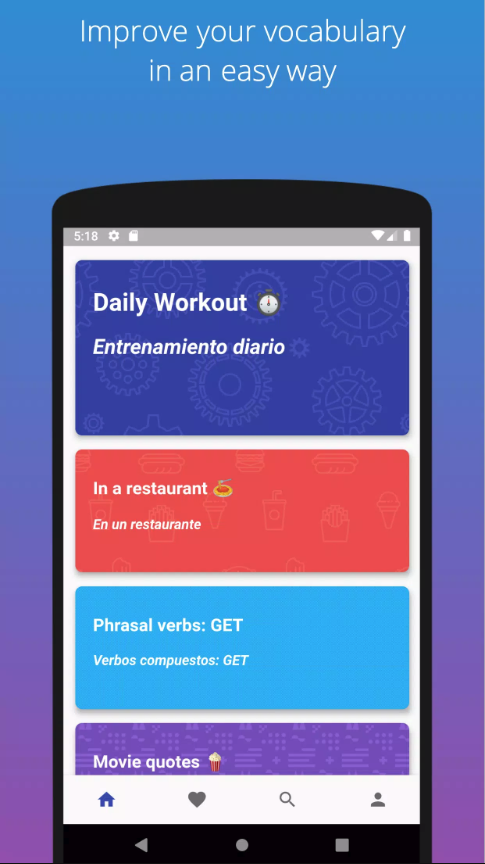
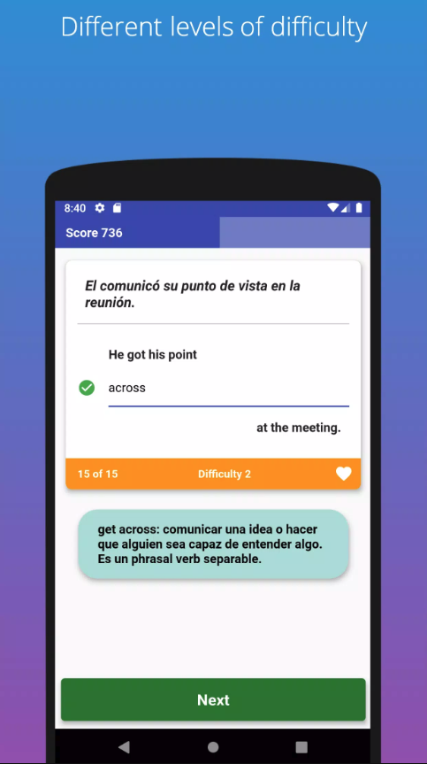
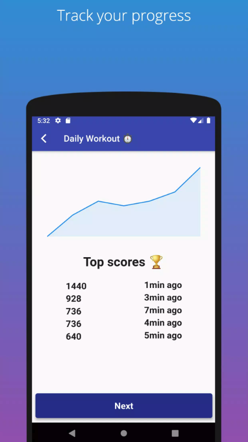

# Memgramm

**A mobile language-learning platform for Spanish speakers mastering English through spaced repetition.**

Memgramm was a full-stack mobile application designed to help Spanish speakers improve their English proficiency using adaptive flashcard methodology. As the sole developer, I designed and implemented the entire system from frontend to backend, managing the complete development lifecycle including CI/CD integration.

The app was available on Android and iOS via the Google Play Store and Apple App Store until early 2025, when it was discontinued due to bandwidth constraints.

## Overview

Memgramm's core value proposition was making English learning accessible, engaging, and scientifically-backed through spaced repetition algorithms. The app combined mobile-first design with a robust backend infrastructure to deliver personalized learning experiences.

## Tech Stack

**Frontend**
- **Framework**: Flutter (Dart)
- **Platforms**: Android
- **Backend Integration**: REST API

**Backend**
- **Runtime**: Firebase Cloud Functions (Node.js)
- **Database**: Firestore (NoSQL)
- **Authentication**: Firebase Authentication
- **Storage**: Firebase Storage (for media assets)

**Admin Tools & DevOps**
- **Content Management Tool**: Golang CLI
- **CI/CD**: Bitrise (automated builds, testing, and deployment)
- **Version Control**: Git

## Key Features

- **Spaced Repetition System**: Adaptive algorithm that optimizes review intervals based on user performance
- **Progress Tracking**: Real-time statistics and learning analytics
- **Offline Support**: Download lesson packs for offline study
- **User Authentication**: Secure account management with Firebase
- **Content Management**: Admin dashboard (Golang tool) for curating and publishing lessons

## Architecture & Implementation Highlights

**Full-Stack Development**: Solo responsibility for all aspects—from UI/UX design decisions to backend scalability

**Serverless Architecture**: Leveraged Firebase Cloud Functions for cost-effective, scalable API endpoints without managing infrastructure

**Content Pipeline**: Built a custom Golang tool to manage lesson creation, testing, and deployment, reducing manual content management overhead

**Automated Deployment**: Integrated Bitrise CI/CD pipeline to automate builds, run tests, and deploy APK/IPA releases to app stores

**Database Design**: Structured Firestore collections to optimize for real-time syncing and minimize read operations, keeping costs manageable

## Project Journey

I documented the entire development process, motivations, technical decisions, and lessons learned in a [blog post](https://herreraja.github.io/blog/never-an-mvp) on an old personal blog. The article covers the MVP strategy, scaling challenges, and postmortem analysis. Apologies for some grammar mistakes, at the time of writing, ChatGPT didn't exist!

## Download & Try It Out

The app is no longer available on the Google Play Store. However, you can download the APK from [an unofficial APK repository](https://apkpure.com/memgramm-english-flashcards-f/com.zancocho.spanglishcards/download).

## Screenshots

